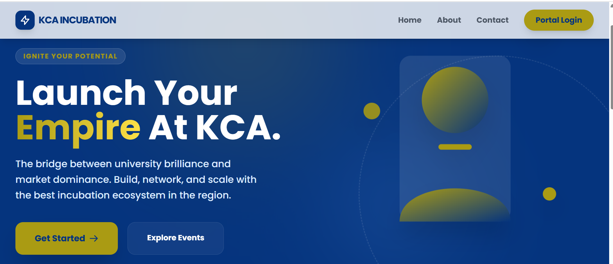
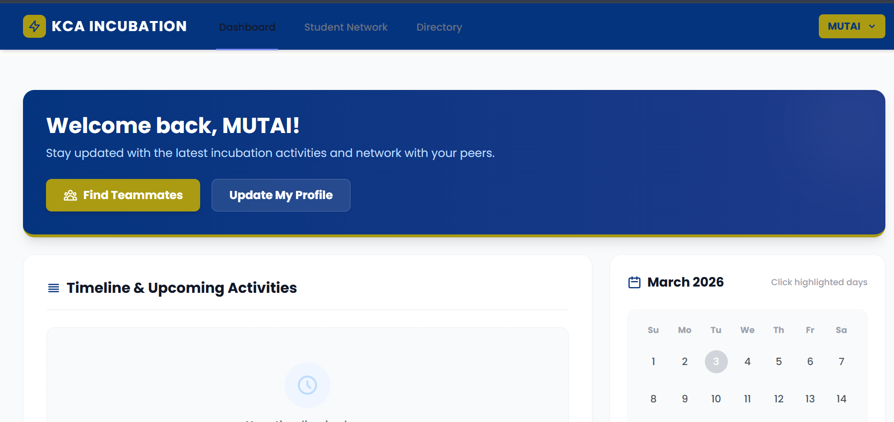
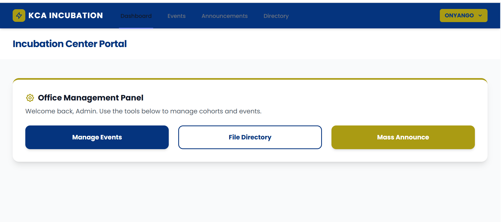
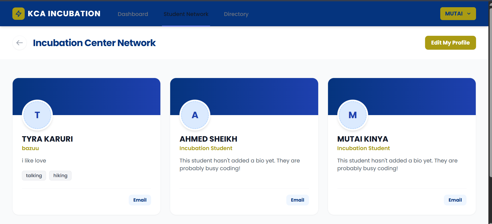

# KCA University Incubation Center ERP


An enterprise-grade Virtual Campus ERP designed specifically to manage the KCA University Incubation ecosystem. This platform bridges the gap between student innovation and professional enterprise management through a seamless, automated, and highly interactive workflow.

## 🚀 Key Features

### 🌐 Public-Facing "SaaS" Landing Page
- **Modular Architecture:** Split-hero design with robust scroll-reveal animations.
- **Dynamic Live Events:** Real-time feed of upcoming workshops, hackathons, and masterclasses fetched directly from the database.
- **Glassmorphism Navigation:** Interactive, robust navbar with a mobile-first slide-out drawer that transitions smoothly on scroll.

### 🛡️ Internal ERP Core
- **Advanced Role-Based Access Control (RBAC):** Distinct, secure interfaces separating normal Students from Office Staff (Assistants, Interns, and Incubation Officers).
- **Google SSO Integration:** Secure, one-click authentication via official student Google Workspace emails.
- **Interactive Event Calendar:** Custom-built dynamic calendar engine highlighting event days, complete with smooth modal popups for event registration and details.

### 🤝 Networking & Resource Hub
- **Student Talent Directory:** A dedicated "Mini-LinkedIn" hub for students to create professional profiles, highlight their skills (e.g., UI/UX, Laravel, Marketing), and find co-founders.
- **Centralized File Hub:** A strictly managed directory for distributing KCA Google Drive resources, pitch deck templates, and cohort documents without relying on WhatsApp links.
- **Mass Communication Engine:** Integrated broadcasting system for dispatching branded, HTML-formatted email announcements to the entire registered student body.

---

## 📸 Interface Showcases

### Public Landing Page
*The first point of contact for guests and future founders, featuring live database events.*


### Student Dashboard & Interactive Calendar
*The central hub featuring a dynamic timeline and an event-synced interactive calendar.*


### Administrative Management
*Restricted tools for office staff to manage events, the resource directory, and mass communications.*


### The Networking Hub
*The talent directory where students connect, share portfolios, and build teams.*


---

## 🛠️ Technical Stack

- **Backend:** Laravel 12.x (PHP 8.2)
- **Frontend:** Vue 3 (Composition API) 
- **State/Routing:** Inertia.js (Modern SPA monolith approach)
- **Styling:** Tailwind CSS (Custom KCA-Navy & KCA-Gold branding)
- **Database:** MySQL / MariaDB
- **Authentication:** Laravel Breeze + Socialite (Google SSO)

---

## ⚙️ Installation & Setup

If you wish to run this project locally, follow these steps:

1. **Clone the repository:**
    ```bash
    git clone [https://github.com/FeiswalDindi/incubation-erp.git](https://github.com/FeiswalDindi/incubation-erp.git)
    cd incubation-erp
    ```

2. **Install PHP and Node.js dependencies:**
    ```bash
    composer install
    npm install
    ```

3. **Configure the Environment:**
    - Copy the example environment file: `cp .env.example .env`
    - Generate the application key: `php artisan key:generate`
    - Update your database credentials in the `.env` file (Ensure `DB_PORT=3307` if using a custom XAMPP setup).
    - Add your Google Client ID and Secret for the SSO integration.

4. **Initialize the Database:**
    Run the migrations and seed the initial Roles and Permissions:
    ```bash
    php artisan migrate:fresh --seed --seeder=RoleAndPermissionSeeder
    ```

5. **Compile Frontend Assets & Run the Server:**
    Open two terminal windows and run:
    ```bash
    npm run dev
    ```
    ```bash
    php artisan serve
    ```

---

## 👨‍💻 Author
**Feiswal Dindi** *Lead Developer & Architect* *B.Sc. Applied Computing, KCA University*